---
## Front matter
lang: ru-RU
title: Лабораторная работа №3
subtitle: Основы информационной безопасности
author:
  - Краснова К. Г., НКАбд-03-24
institute:
  - Российский университет дружбы народов, Москва, Россия
date: 21 марта 2026

## i18n babel
babel-lang: russian
babel-otherlangs: english

## Formatting pdf
toc: false
toc-title: Содержание
slide_level: 2
aspectratio: 169
section-titles: true
theme: metropolis
header-includes:
 - \metroset{progressbar=frametitle,sectionpage=progressbar,numbering=fraction}
---

## Цель работы

Получить практические навыки работы в консоли с атрибутами файлов для групп пользователей.

## Задание

1. Создание пользователя guest2, добавление его в группу пользователей guest
2. Заполнение таблицы 3.1
3. Заполнение таблицы 3.2 на основе таблицы 3.1.

## Теоретическое введение

**Права доступа** определяют, какие действия конкретный пользователь может или не может совершать с определенным файлами и каталогами. С помощью разрешений можно создать надежную среду — такую, в которой никто не может поменять содержимое ваших документов или повредить системные файлы. [1]

**Группы пользователей Linux** кроме стандартных root и users, здесь есть еще пару десятков групп. Это группы, созданные программами, для управления доступом этих программ к общим ресурсам. Каждая группа разрешает чтение или запись определенного файла или каталога системы, тем самым регулируя полномочия пользователя, а следовательно, и процесса, запущенного от этого пользователя. Здесь можно считать, что пользователь - это одно и то же что процесс, потому что у процесса все полномочия пользователя, от которого он запущен. [2]

## Теоретическое введение

- daemon - от имени этой группы и пользователя daemon запускаютcя сервисы, которым необходима возможность записи файлов на диск.
- sys - группа открывает доступ к исходникам ядра и файлам - include сохраненным в системе
- sync - позволяет выполнять команду /bin/sync
- games - разрешает играм записывать свои файлы настроек и историю в определенную папку
- man - позволяет добавлять страницы в директорию /var/cache/man
- lp - позволяет использовать устройства параллельных портов
- mail - позволяет записывать данные в почтовые ящики /var/mail/
- proxy - используется прокси серверами, нет доступа записи файлов на диск
- www-data - с этой группой запускается веб-сервер, она дает доступ на запись /var/www, где находятся файлы веб-документов

## Теоретическое введение

- list - позволяет просматривать сообщения в /var/mail
- nogroup - используется для процессов, которые не могут создавать файлов на жестком диске, а только читать, обычно применяется вместе с пользователем nobody.
- adm - позволяет читать логи из директории /var/log
- tty - все устройства /dev/vca разрешают доступ на чтение и запись пользователям из этой группы
- disk - открывает доступ к жестким дискам /dev/sd* /dev/hd*, можно сказать, что это аналог рут доступа.
- dialout - полный доступ к серийному порту
- cdrom - доступ к CD-ROM
- wheel - позволяет запускать утилиту sudo для повышения привилегий
- audio - управление аудиодрайвером

## Теоретическое введение

- src - полный доступ к исходникам в каталоге /usr/src/
- shadow - разрешает чтение файла /etc/shadow
- utmp - разрешает запись в файлы /var/log/utmp /var/log/wtmp
- video - позволяет работать с видеодрайвером
- plugdev - позволяет монтировать внешние устройства USB, CD и т д
- staff - разрешает запись в папку /usr/local

## Выполнение лабораторной работы

С правами администратора создаю пользователя guest с помощью команды `useradd`, далее с помощью команды `passwd` задаю пароль пользователю (рис. 1).

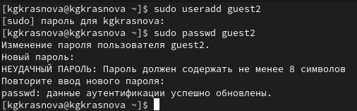{#fig-001 width=70%}

## Выполнение лабораторной работы

Добавляю пользователя guest2 в группу guest(рис. 2).

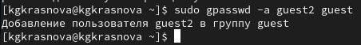{#fig-002 width=70%}

## Выполнение лабораторной работы

Зашла на двух разных консолях от имени двух разных пользователей с помощью команды `su <имя пользователя>` (рис. 3).

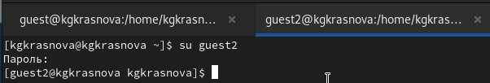{#fig-003 width=70%}

## Выполнение лабораторной работы

Проверяю путь директории для guest (рис. 4).

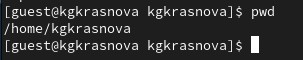{#fig-004 width=70%}

## Выполнение лабораторной работы

Для guest2 (рис. 5).

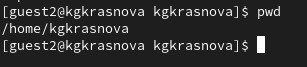{#fig-005 width=70%}

## Выполнение лабораторной работы

Проверяю имя пользователей с поомощью команды whoami, с помощью команды id могу увидеть группы, к которым принадлежит пользователь и коды этих групп (gid), команда groups просто выведет список групп, в которые входит пользователь. Проверка для пользователя guest(рис. 6).

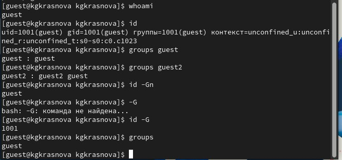{#fig-006 width=70%}

## Выполнение лабораторной работы

Проверка для пользователя guest2 (рис. 7).

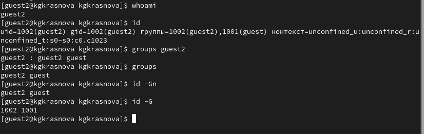{#fig-007 width=70%}

## Выполнение лабораторной работы

Вывела интересующее меня содержимое файла etc/group, видно, что в группе guest два пользователя, а в группе guest2 один (рис. 8).

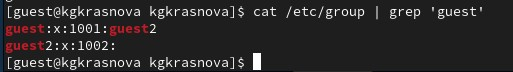{#fig-008 width=70%}

## Выполнение лабораторной работы

От имени пользователя guest2 регистрирую его в группе guest с помощью команды `newgrp` (рис. 9).

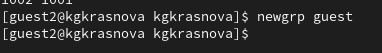{#fig-009 width=70%}

## Выполнение лабораторной работы

Добавляю права на чтение, запись и исполнение группе пользвателей guest (guest, guest2) на директорию home/guest в которой находятся все файлы для последующей работы (рис. 10).

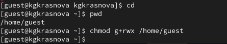{#fig-010 width=70%}

## Выполнение лабораторной работы

11. От имени пользователя guest снимаю все атрибуты с директории dir1, созданной в предыдущей лабораторной работе. Проверяю, что права действительно сняты (рис. 11).

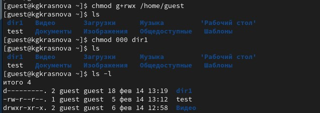{#fig-011 width=70%}

## Заполнение таблицы 3.1

Далее проверяю как пользователь guest2 будет взаимодействовать с файлами в этой директории (рис. 12).

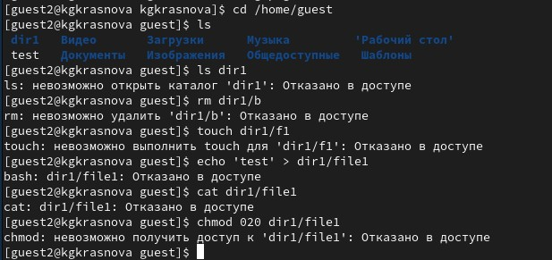{#fig-012 width=70%}

## Выводы

Были получены практические навыки работы в консоли с атрибутами файлов для групп пользователей
