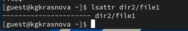
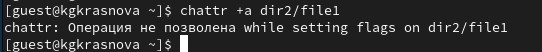
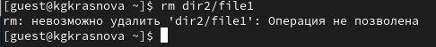
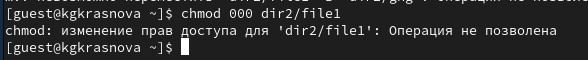
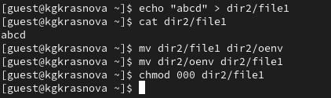
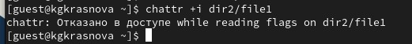
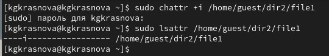
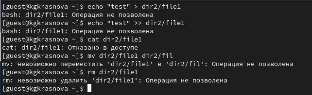

---
## Front matter
lang: ru-RU
title: Лабораторная работа №1
subtitle: Основы информационной безопасности
author:
  - Краснова К. Г., НКАбд-03-24
institute:
  - Российский университет дружбы народов, Москва, Россия
date: 17 февраля 2026

## i18n babel
babel-lang: russian
babel-otherlangs: english

## Formatting pdf
toc: false
toc-title: Содержание
slide_level: 2
aspectratio: 169
section-titles: true
theme: metropolis
header-includes:
 - \metroset{progressbar=frametitle,sectionpage=progressbar,numbering=fraction}
---

## Цель работы

Получение практических навыков работы в консоли с расширенными
атрибутами файлов

## Теоретическое введение

**Права доступа** определяют, какие действия конкретный пользователь может или не может совершать с определенным файлами и каталогами. С помощью разрешений можно создать надежную среду — такую, в которой никто не может поменять содержимое ваших документов или повредить системные файлы. [1]

**Расширенные атрибуты файлов Linux** представляют собой пары имя:значение, которые постоянно связаны с файлами и каталогами, подобно тому как строки окружения связаны с процессом. Атрибут может быть определён или не определён. Если он определён, то его значение может быть или пустым, или не пустым. [2]

## Теоретическое введение

Расширенные атрибуты дополняют обычные атрибуты, которые связаны со всеми inode в файловой системе (т. е., данные stat(2)). Часто они используются для предоставления дополнительных возможностей файловой системы, например, дополнительные возможности безопасности, такие как списки контроля доступа (ACL), могут быть реализованы через расширенные атрибуты. [3]

## Теоретическое введение

*Установить атрибуты:*

- chattr filename

*Значения:*

- chattr +a # только добавление. Удаление и переименование запрещено;

- chattr +A # не фиксировать данные об обращении к файлу

- chattr +c # сжатый файл

- chattr +d # неархивируемый файл

- chattr +i # неизменяемый файл

## Теоретическое введение

- chattr +S # синхронное обновление

- chattr +s # безопасное удаление, (после удаления место на диске переписывается нулями)

- chattr +u # неудаляемый файл

- chattr -R # рекурсия

## Теоретическое введение

*Просмотреть атрибуты:*

- lsattr filename

*Опции:*

- lsattr -R # рекурсия

- lsattr -a # вывести все файлы (включая скрытые)

- lsattr -d # не выводить содержимое директории

## Выполнение лабораторной работы

В учетной записи guest определяю расширенные атрибуты файла `/home/guest/dir1/file1`([рис. @fig-001]).

{#fig-001 width=70%}

## Выполнение лабораторной работы

Изменяю права доступа для файла с chmod 600 ([рис. @fig-002]).

{#fig-002 width=70%}

## Выполнение лабораторной работы

Пытаюсь установить на файл расширенный атрибут а от имени пользователя guest, но получаю отказ ([рис. @fig-003]).

{#fig-003 width=70%}

## Выполнение лабораторной работы

От имени суперпользователя отказа в установке прав нет ([рис. @fig-004]).

{#fig-004 width=70%}

## Выполнение лабораторной работы

Проверяю правильность установки атрибута ([рис. @fig-005]).

{#fig-005 width=70%}

## Выполнение лабораторной работы

Выполняю дозапись в файл, далее выполняю чтение файла ([рис. @fig-006]).

{#fig-006 width=70%}

## Выполнение лабораторной работы

Пробую удалить файл, получаю отказ от выполнения действия ([рис. @fig-007]).

{#fig-007 width=70%}

## Выполнение лабораторной работы

То же самое получаю при попытке переименовать файл ([рис. @fig-007]).

{#fig-008 width=70%}

## Выполнение лабораторной работы

Получаю отказ от выполнения при попытке установить другие права доступа ([рис. @fig-009]).

{#fig-009 width=70%}

## Выполнение лабораторной работы

Снимаю расширенные атрибуты с файла ([рис. @fig-010]).

{#fig-010 width=70%}

## Выполнение лабораторной работы

Проверяю ранее не удавшиеся действия: чтение, переименование, изменение прав доступа. Теперь все из этого выполняется ([рис. @fig-011]).

{#fig-011 width=70%}

## Выполнение лабораторной работы

Пытаюсь добавить расширенный атрибут i от имени пользователя guest, как и раньше, получаю отказ ([рис. @fig-012]).

{#fig-012 width=70%}

## Выполнение лабораторной работы

Добавляю расширенный атрибут i от имени суперпользователя, теперь все выполнено верно ([рис. @fig-013]).

{#fig-013 width=70%}

## Выполнение лабораторной работы

Пытаюсь записать в файл, дозаписать, переименовать или удалить, ничего из этого сделать нельзя([рис. @fig-014]).

{#fig-014 width=70%}

## Выводы

В результате выполнения работы вы повысили свои навыки использования интерфейса командой строки (CLI), познакомились на примерах с тем,
как используются основные и расширенные атрибуты при разграничении
доступа. Имели возможность связать теорию дискреционного разделения
доступа (дискреционная политика безопасности) с её реализацией на практике в ОС Linux. Опробовали действие на практике расширенных атрибутов «а» и «i»

