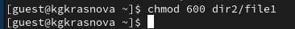
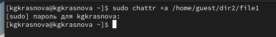
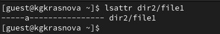
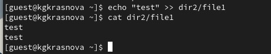
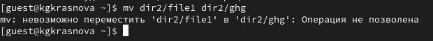
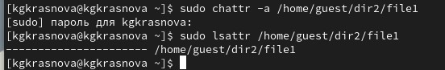

---
## Author
author:
  name: Дмитрий Сергеевич Кулябов
  degrees: DSc
  orcid: 0000-0002-0877-7063
  email: kulyabov-ds@rudn.ru
  affiliation:
    - name: Российский университет дружбы народов
      country: Российская Федерация
      postal-code: 117198
      city: Москва
      address: ул. Миклухо-Маклая, д. 6

## Title
title: "Шаблон отчёта по лабораторной работе"
subtitle: "Простейший вариант"
license: "CC BY"
---

# Цель работы

Получение практических навыков работы в консоли с расширенными
атрибутами файлов

# Теоретическое введение

**Права доступа** определяют, какие действия конкретный пользователь может или не может совершать с определенным файлами и каталогами. С помощью разрешений можно создать надежную среду — такую, в которой никто не может поменять содержимое ваших документов или повредить системные файлы. [1]

**Расширенные атрибуты файлов Linux** представляют собой пары имя:значение, которые постоянно связаны с файлами и каталогами, подобно тому как строки окружения связаны с процессом. Атрибут может быть определён или не определён. Если он определён, то его значение может быть или пустым, или не пустым. [2]

Расширенные атрибуты дополняют обычные атрибуты, которые связаны со всеми inode в файловой системе (т. е., данные stat(2)). Часто они используются для предоставления дополнительных возможностей файловой системы, например, дополнительные возможности безопасности, такие как списки контроля доступа (ACL), могут быть реализованы через расширенные атрибуты. [3]

*Установить атрибуты:*

- chattr filename

*Значения:*

- chattr +a # только добавление. Удаление и переименование запрещено;

- chattr +A # не фиксировать данные об обращении к файлу

- chattr +c # сжатый файл

- chattr +d # неархивируемый файл

- chattr +i # неизменяемый файл

- chattr +S # синхронное обновление

- chattr +s # безопасное удаление, (после удаления место на диске переписывается нулями)

- chattr +u # неудаляемый файл

- chattr -R # рекурсия

*Просмотреть атрибуты:*

- lsattr filename

*Опции:*

- lsattr -R # рекурсия

- lsattr -a # вывести все файлы (включая скрытые)

- lsattr -d # не выводить содержимое директории

# Выполнение лабораторной работы

В учетной записи guest определяю расширенные атрибуты файла `/home/guest/dir1/file1`([рис. @fig-001]).

{#fig-001 width=70%}

Изменяю права доступа для файла с chmod 600 ([рис. @fig-002]).

{#fig-002 width=70%}

Пытаюсь установить на файл расширенный атрибут а от имени пользователя guest, но получаю отказ ([рис. @fig-003]).

{#fig-003 width=70%}

От имени суперпользователя отказа в установке прав нет ([рис. @fig-004]).

{#fig-004 width=70%}

Проверяю правильность установки атрибута ([рис. @fig-005]).

{#fig-005 width=70%}

Выполняю дозапись в файл, далее выполняю чтение файла ([рис. @fig-006]).

{#fig-006 width=70%}

Пробую удалить файл, получаю отказ от выполнения действия ([рис. @fig-007]).

{#fig-007 width=70%}

То же самое получаю при попытке переименовать файл ([рис. @fig-007]).

{#fig-008 width=70%}

Получаю отказ от выполнения при попытке установить другие права доступа ([рис. @fig-009]).

{#fig-009 width=70%}

Снимаю расширенные атрибуты с файла ([рис. @fig-010]).

{#fig-010 width=70%}

Проверяю ранее не удавшиеся действия: чтение, переименование, изменение прав доступа. Теперь все из этого выполняется ([рис. @fig-011]).

{#fig-011 width=70%}

Пытаюсь добавить расширенный атрибут i от имени пользователя guest, как и раньше, получаю отказ ([рис. @fig-012]).

{#fig-012 width=70%}

Добавляю расширенный атрибут i от имени суперпользователя, теперь все выполнено верно ([рис. @fig-013]).

{#fig-013 width=70%}

Пытаюсь записать в файл, дозаписать, переименовать или удалить, ничего из этого сделать нельзя([рис. @fig-014]).

{#fig-014 width=70%}

# Выводы

В результате выполнения работы вы повысили свои навыки использования интерфейса командой строки (CLI), познакомились на примерах с тем,
как используются основные и расширенные атрибуты при разграничении
доступа. Имели возможность связать теорию дискреционного разделения
доступа (дискреционная политика безопасности) с её реализацией на практике в ОС Linux. Опробовали действие на практике расширенных атрибутов «а» и «i»

# Список литературы. Библиография

[0] Методические материалы курса

[1] Права доступа: https://codechick.io/tutorials/unix-linux/unix-linux-permissions

[2] Расширенные атрибуты: https://ru.manpages.org/xattr/7

[3] Операции с расширенными атрибутами: https://p-n-z-8-8.livejournal.com/64493.html
