---
## Author
author:
  name: Дмитрий Сергеевич Кулябов
  degrees: DSc
  orcid: 0000-0002-0877-7063
  email: kulyabov-ds@rudn.ru
  affiliation:
    - name: Российский университет дружбы народов
      country: Российская Федерация
      postal-code: 117198
      city: Москва
      address: ул. Миклухо-Маклая, д. 6

## Title
title: "Шаблон отчёта по лабораторной работе"
subtitle: "Простейший вариант"
license: "CC BY"
---

# Цель работы


Изучение механизмов изменения идентификаторов, применения SetUID- и Sticky-битов. Получение практических навыков работы в консоли с дополнительными атрибутами. Рассмотрение работы механизма смены идентификатора процессов пользователей, а также влияние бита Sticky на запись и удаление файлов.


# Теоретическое введение

1. Дополнительные атрибуты файлов Linux

В Linux существует три основных вида прав — право на чтение (read), запись (write) и выполнение (execute), а также три категории пользователей, к которым они могут применяться — владелец файла (user), группа владельца (group) и все остальные (others). Но, кроме прав чтения, выполнения и записи, есть еще три дополнительных атрибута. [@u]

**Sticky bit**

Используется в основном для каталогов, чтобы защитить в них файлы. В такой каталог может писать любой пользователь. Но, из такой директории пользователь может удалить только те файлы, владельцем которых он является. Примером может служить директория /tmp, в которой запись открыта для всех пользователей, но нежелательно удаление чужих файлов.

**SUID (Set User ID)**

Атрибут исполняемого файла, позволяющий запустить его с правами владельца. В Linux приложение запускается с правами пользователя, запустившего указанное приложение. Это обеспечивает дополнительную безопасность т.к. процесс с правами пользователя не сможет получить доступ к важным системным файлам, которые принадлежат пользователю root.

**SGID (Set Group ID)**

Аналогичен suid, но относиться к группе. Если установить sgid для каталога, то все файлы созданные в нем, при запуске будут принимать идентификатор группы каталога, а не группы владельца, который создал файл в этом каталоге.

**Обозначение атрибутов sticky, suid, sgid**

Специальные права используются довольно редко, поэтому при выводе программы ls -l символ, обозначающий указанные атрибуты, закрывает символ стандартных прав доступа.

Пример:
`rwsrwsrwt`

где первая s — это suid, вторая s — это sgid, а последняя t — это sticky bit

В приведенном примере не понятно, rwt — это rw- или rwx? Определить это просто. Если t маленькое, значит x установлен. Если T большое, значит x не установлен. То же самое правило распространяется и на s.

В числовом эквиваленте данные атрибуты определяются первым символом при четырехзначном обозначении (который часто опускается при назначении прав), например в правах 1777 — символ 1 обозначает sticky bit. Остальные атрибуты имеют следующие числовое соответствие:

```
1 — установлен sticky bit
2 — установлен sgid
4 — установлен suid
```

2. Компилятор GCC

GСС - это свободно доступный оптимизирующий компилятор для языков C, C++. Собственно программа gcc это некоторая надстройка над группой компиляторов, которая способна анализировать имена файлов, передаваемые ей в качестве аргументов, и определять, какие действия необходимо выполнить. Файлы с расширением .cc или .C рассматриваются, как файлы на языке C++, файлы с расширением .c как программы на языке C, а файлы c расширением .o считаются объектными [@gcc].

# Выполнение лабораторной работы

Создание файла simpled.c и запись в файл кода ([рис. @fig-001]).

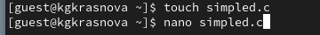{#fig-001 width=70%}

```C++ Листинг 1
#include <sys/types.h>
#include <unistd.h>
#include <stdio.h>
int
main ()
{
uid_t uid = geteuid ();
gid_t gid = getegid ();
printf ("uid=%d, gid=%d\n", uid, gid);
return 0;
}
```

Cодержимое файла ([рис. @fig-002]).

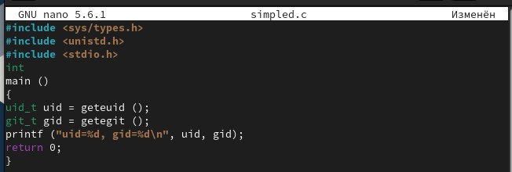{#fig-002 width=70%}

Компилирую файл, проверяю, что он скомпилировался ([рис. @fig-003]).

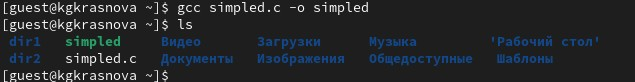{#fig-003 width=70%}

Запускаю исполняемый файл. В выводе файла выписыны номера пользоватея и групп ([рис. @fig-004]).

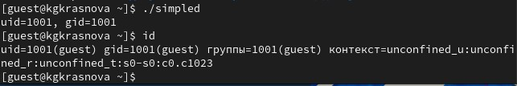{#fig-004 width=70%}

Создание, запись в файл и компиляция файла simpled2.c. Запуск программы ([рис. @fig-005]).

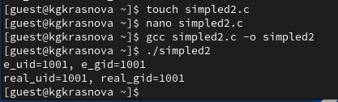{#fig-005 width=70%}


```C++ Листинг 2
#include <sys/types.h>
#include <unistd.h>
#include <stdio.h>
int
main ()
{
uid_t real_uid = getuid ();
uid_t e_uid = geteuid ();
gid_t real_gid = getgid ();
gid_t e_gid = getegid () ;
printf ("e_uid=%d, e_gid=%d\n", e_uid, e_gid);
printf ("real_uid=%d, real_gid=%d\n", real_uid,
real_gid);
return 0;
}
```

Содержимое файла ([рис. @fig-006]).

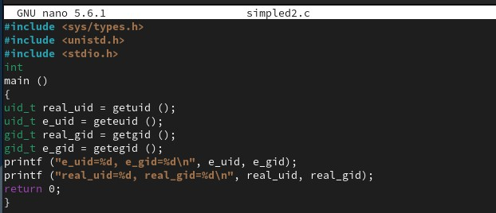{#fig-006 width=70%}

С помощью chown изменяю владельца файла на суперпользователя, с помощью chmod изменяю права доступа ([рис. @fig-007]).

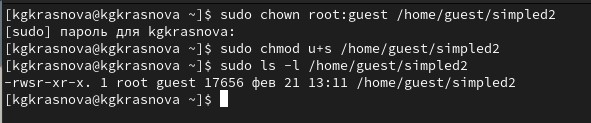{#fig-007 width=70%}

Сравнение вывода программы и команды id ([рис. @fig-008]).

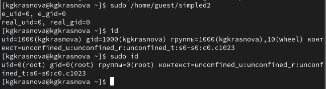{#fig008 width=70%}

Создание и компиляция файла readfile.c ([рис. @fig-009]).

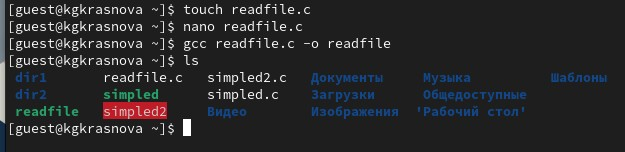{#fig-009 width=70%}

```C++ Листинг 3
#include <fcntl.h>
#include <stdio.h>
#include <sys/stat.h>
#include <sys/types.h>
#include <unistd.h>
int
main (int argc, char* argv[])
{
unsigned char buffer[16];
size_t bytes_read;
int i;
int fd = open (argv[1], O_RDONLY);
do
{
bytes_read = read (fd, buffer, sizeof (buffer));
for (i =0; i < bytes_read; ++i) printf("%c", buffer[i]);
}
while (bytes_read == sizeof (buffer));
close (fd);
return 0;
}
```

Содержимое файла ([рис. @fig-010]).

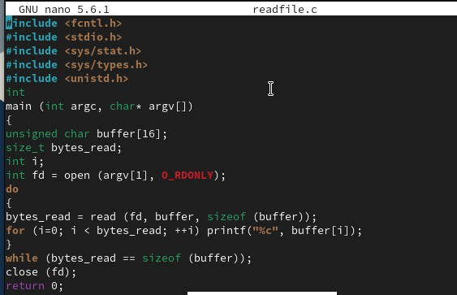{#fig-01 width=70%}

Снова от имени суперпользователи меняю владельца файла readfile. Далее меняю права доступа ([рис. @fig-011]).

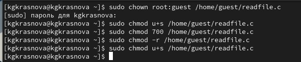{#fig-011 width=70%}

Проверка прочесть файл от имени пользователя guest ([рис. @fig-012]).

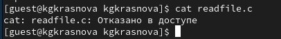{#fig-012 width=70%}

Попытка прочесть тот же файл с помощью программы readfile ([рис. @fig-013]).

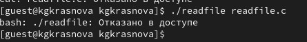{#fig-013 width=70%}

Попытка прочесть файл `\etc\shadow` с помощью программы, все еще получаем отказ в доступе ([рис. @fig-014]).

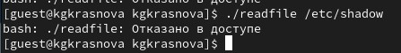{#fig-014 width=70%}

Пробую прочесть эти же файлы от имени суперпользователя и чтение файлов проходит успешно ([рис. @fig-015]).

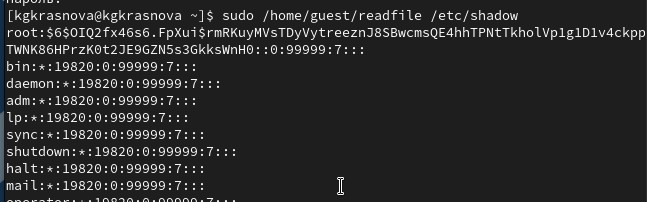{#fig-015 width=70%}

Проверяем папку tmp на наличие атрибута Sticky ([рис. @fig-016]).

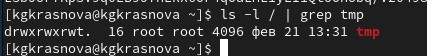{#fig-016 width=70%}

От имени пользователя guest создаю файл с текстом, добавляю права на чтение и запись для других пользователей ([рис. @fig-017]).

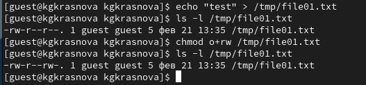{#fig-017 width=70%}

Вхожу в систему от имени пользователя guest2, от его имени могу прочитать файл file01.txt, но перезаписать информацию в нем не могу ([рис. @fig-018]).

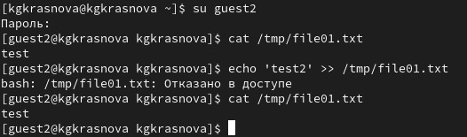{#fig-018 width=70%}

Также невозможно добавить в файл file01.txt новую информацию от имени пользователя guest2 ([рис. @fig-019]).

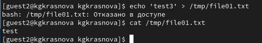{#fig-019 width=70%}

Далее пробуем удалить файл, снова получаем отказ ([рис. @fig-020]).

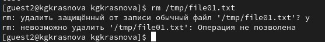{#fig-020 width=70%}

От имени суперпользователя снимаем с директории атрибут Sticky ([рис. @fig-021]).

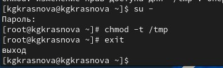{#fig-021 width=70%}

Проверяем, что атрибут действительно снят ([рис. @fig-022]).

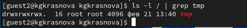{#fig-022 width=70%}

Далее был выполнен повтор предыдущих действий ([рис. @fig-023]).

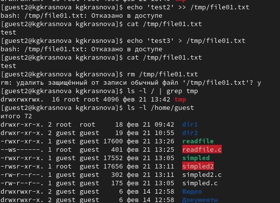{#fig-023 width=70%}

Возвращение директории tmp атрибута t от имени суперпользователя ([рис. @fig-024]).

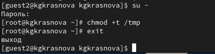{#fig-024 width=70%}


# Выводы

Изучила механизм изменения идентификаторов, применила
SetUID- и Sticky-биты. Получила практические навыки работы в кон-
соли с дополнительными атрибутами. Рассмотрела работы механизма
смены идентификатора процессов пользователей, а также влияние бита
Sticky на запись и удаление файлов.

# Список литературы{.unnumbered}

::: {#refs}
:::
