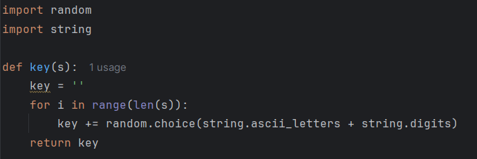
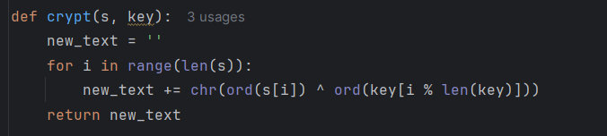
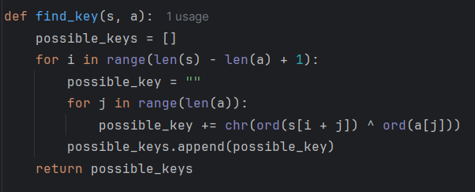
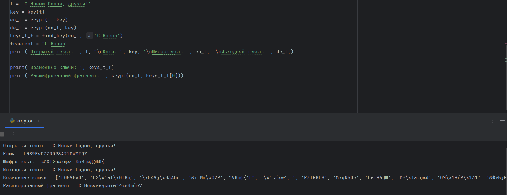

---
## Front matter
lang: ru-RU
title: Лабораторная работа №7
subtitle: Основы информационной безопасности
author:
  - Краснова К. Г., НКАбд-03-24
institute:
  - Российский университет дружбы народов, Москва, Россия
date: 17 февраля 2026

## i18n babel
babel-lang: russian
babel-otherlangs: english

## Formatting pdf
toc: false
toc-title: Содержание
slide_level: 2
aspectratio: 169
section-titles: true
theme: metropolis
header-includes:
 - \metroset{progressbar=frametitle,sectionpage=progressbar,numbering=fraction}
---

## Цель работы

Освоить на практике применение режима однократного гаммирования

## Задание

Нужно подобрать ключ, чтобы получить сообщение «С Новым Годом,
друзья!». Требуется разработать приложение, позволяющее шифровать и
дешифровать данные в режиме однократного гаммирования. Приложение
должно:
1. Определить вид шифротекста при известном ключе и известном открытом тексте.
2. Определить ключ, с помощью которого шифротекст может быть преобразован в некоторый фрагмент текста, представляющий собой один из возможных вариантов прочтения открытого текста

## Теоретическое введение

Предложенная Г. С. Вернамом так называемая «схема однократного использования (гаммирования)» является простой, но надёжной схемой шифрования данных. [@course]

**Гаммирование** представляет собой наложение (снятие) на открытые (зашифрованные) данные последовательности элементов других данных, полученной с помощью некоторого криптографического алгоритма, для получения зашифрованных (открытых) данных. Иными словами, наложение
гаммы — это сложение её элементов с элементами открытого (закрытого)
текста по некоторому фиксированному модулю, значение которого представляет собой известную часть алгоритма шифрования.

## Теоретическое введение

В соответствии с теорией криптоанализа, если в методе шифрования используется однократная вероятностная гамма (однократное гаммирование)
той же длины, что и подлежащий сокрытию текст, то текст нельзя раскрыть.
Даже при раскрытии части последовательности гаммы нельзя получить информацию о всём скрываемом тексте.

Наложение гаммы по сути представляет собой выполнение операции
сложения по модулю 2 (XOR) (обозначаемая знаком ⊕) между элементами
гаммы и элементами подлежащего сокрытию текста. Напомним, как работает операция XOR над битами: 0 ⊕ 0 = 0, 0 ⊕ 1 = 1, 1 ⊕ 0 = 1, 1 ⊕ 1 = 0.

## Теоретическое введение
Такой метод шифрования является симметричным, так как двойное прибавление одной и той же величины по модулю 2 восстанавливает исходное значение, а шифрование и расшифрование выполняется одной и той же про-
граммой.

Если известны ключ и открытый текст, то задача нахождения шифротекста заключается в применении к каждому символу открытого текста следующего правила: 

`Ci = Pi ⊕ Ki`, (7.1)

## Теоретическое введение

*где Ci — i-й символ получившегося зашифрованного послания, Pi — i-й
символ открытого текста, Ki — i-й символ ключа, i = 1, m. Размерности
открытого текста и ключа должны совпадать, и полученный шифротекст
будет такой же длины.*

Если известны шифротекст и открытый текст, то задача нахождения
ключа решается также в соответствии с (7.1), а именно, обе части равенства необходимо сложить по модулю 2 с Pi:

`Ci ⊕ Pi = Pi ⊕ Ki ⊕ Pi = Ki`,

`Ki = Ci ⊕ Pi`.

## Теоретическое введение

Открытый текст имеет символьный вид, а ключ — шестнадцатеричное
представление. Ключ также можно представить в символьном виде, воспользовавшись таблицей ASCII-кодов.

К. Шеннон доказал абсолютную стойкость шифра в случае, когда однократно используемый ключ, длиной, равной длине исходного сообщения,
является фрагментом истинно случайной двоичной последовательности с
равномерным законом распределения. Криптоалгоритм не даёт никакой информации об открытом тексте: при известном зашифрованном сообщении
C все различные ключевые последовательности K возможны и равновероятны, а значит, возможны и любые сообщения P.

## Теоретическое введение

Необходимые и достаточные условия абсолютной стойкости шифра:

- полная случайность ключа;

- равенство длин ключа и открытого текста;

- однократное использование ключа.

## Теоретическое введение

Рассмотрим пример.

Ключ Центра:

`05 0C 17 7F 0E 4E 37 D2 94 10 09 2E 22 57 FF C8 0B B2 70 54`

Сообщение Центра:

*Штирлиц – Вы Герой!!*

`D8 F2 E8 F0 EB E8 F6 20 2D 20 C2 FB 20 C3 E5 F0 EE E9 21 21`

Зашифрованный текст, находящийся у Мюллера:

`DD FE FF 8F E5 A6 C1 F2 B9 30 CB D5 02 94 1A 38 E5 5B 51 75`

Дешифровальщики попробовали ключ:

`05 0C 17 7F 0E 4E 37 D2 94 10 09 2E 22 55 F4 D3 07 BB BC 54`

и получили текст:

`D8 F2 E8 F0 EB E8 F6 20 2D 20 C2 FB 20 C1 EE EB E2 E0 ED 21`

*Штирлиц - Вы Болван!*

## Теоретическое введение

Другие ключи дадут лишь новые фразы, пословицы, стихотворные
строфы, словом, всевозможные тексты заданной длины.

## Выполнение лабораторной работы

Я выполнала лабораторную работа на языке программирования Python, листинг программы и результаты выполнения приведены в отчете.

 Требуется разработать программу, позволяющее шифровать и дешифровать данные в режиме однократного гаммирования. Начнем с создания функции для генерации случайного ключа (рис. [-@fig:001]).

{#fig:001 width=70%}

## Выполнение лабораторной работы
Необходимо определить вид шифротекста при известном ключе и известном открытом тексте. Так как операция исключающего или отменяет сама себя, делаю одну функцю и для шифрования и для дешифрования текста (рис. [-@fig:002]).

{#fig:002 width=70%}

## Выполнение лабораторной работы

Нужно определить ключ, с помощью которого шифротекст может быть преобразован в некоторый фрагмент текста, представляющий собой один из возможных вариантов прочтения открытого текста. Для этого создаю функцию для нахождения возможных ключей для фрагмента текста (рис. [-@fig:003]). 

{#fig:003 width=70%}

## Выполнение лабораторной работы

Проверка работы всех функций. Шифрование и дешифрование происходит верно, как и нахождение ключей, с помощью которых можно расшифровать верно только кусок текста (рис. [-@fig:004]).

{#fig:004 width=70%}

# Выводы

В ходе выполнения данной лабораторной работы мной было освоено на практике применение режима однократного гаммирования.
