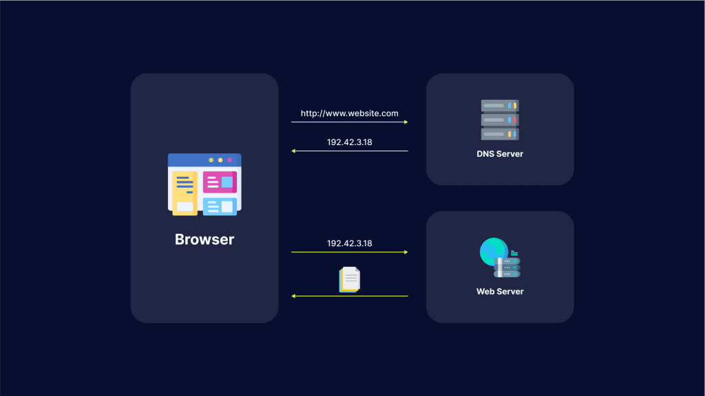

---
## Author
author:
  name: Краснова Камилла Геннадьевна
  degrees: бакалавр
  email: 1132246076@rudn.ru
  affiliation:
    - name: Российский университет дружбы народов
      country: Российская Федерация
      postal-code: 117198
      city: Москва
      address: ул. Миклухо-Маклая, д. 6
## Title
title: Типы DNS-атак
subtitle: Доклад
license: CC BY
date: today
date-format: "2026-03-01" 
---

# Информация

## Докладчик

:::::::::::::: {.columns align=center}
::: {.column width="70%"}

- Краснова Камилла Геннадьевна
- студент группы НКАбд-03-24
- ст.б. № 1132246076
- Российский университет дружбы народов
- [1132246076@rudn.ru](mailto:1132246076@rudn.ru)
- < (https://github.com/kakras/)https://github.com/kakras/> (https://github.com/kakras/)

:::
::: {.column width="30%"}

:::
::::::::::::::

# Основная часть

## Что такое DNS и почему он уязвим?
 
DNS - «адресная книга» интернета.
DNS используется для: 1. Получения IP-адреса; 2. Получения информации о маршрутизации почты.
Это критическая точка инфраструктуры: при отказе - недоступность всех интернет ресурсов.
 

## Важность защиты
 
По отчету International Data Corporation за 2023 год, организации в каждой отрасли подвергались атакам больше 7 раз в год.

## Типы атак
 
Туннелирование: данные "упаковываются" в DNS-запросы для скрытого канала.
 
Усиление: DDoS через поддельные запросы с большим ответом.
 
Флуд: перегруз сервера массой поддельных запросов.
 

## Типы атак

- Спуфинг: подмена данных.
- Взлом: контроль над сервером, перенаправление на вредоносные ресурсы.
- Атака NXDOMAIN: запросы к несуществующим доменам

## Способы защиты

- Отключите ненужные DNS-преобразователи
- Разместите преобразователи за брандмауэром
- Отделите авторитетный сервер от преобразователя
- Включите DNSSEC у регистратора

## Заключение
 
Атаки приводят к утечкам данных, простоям, финансовым потерям.
 
Понимание угроз - первый шаг к защите критической инфраструктуры.

:::
