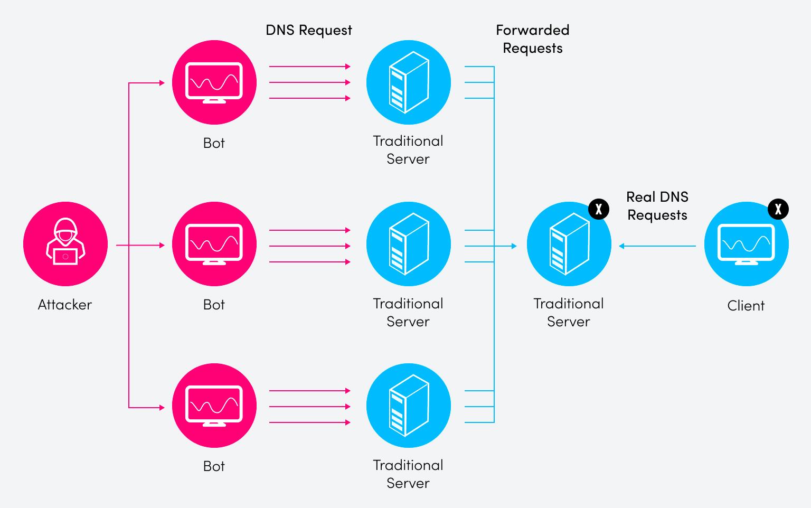

---
## Author
author:
  name: Краснова Камилла Геннадьевна
  degrees: DSc
  orcid: 0000-0002-0877-7063
  email: 1132246076@rudn.ru
  affiliation:
    - name: Российский университет дружбы народов
      country: Российская Федерация
      postal-code: 117198
      city: Москва
      address: ул. Миклухо-Маклая, д. 6

## Title
title: "Типы DNS атак"
subtitle: "Основы информационной безопасности"
license: "CC BY"
---

# Что такое DNS и почему он уязвим?

Система доменных имён DNS — это компьютерная распределённая система для получения информации о доменах. Её можно назвать «адресной книгой» интернета: она переводит символьное написание, привычное человеку, в набор цифр — IP-адрес. 
Чаще всего DNS используется для получения IP-адреса по имени хоста, получения информации о маршрутизации почты и обслуживающих узлах для протоколов в домене. Если выйдут из строя DNS-серверы, пользователи не смогут воспользоваться интернет-ресурсами: некому будет переводить язык пользователя — буквенное обозначение домена — на машинный язык, то есть IP-адрес. Набрав нужный адрес, пользователь получит ошибку и решит, что интернет вовсе не работает. (рис. [-@fig:001]). 

{#fig:001 width=70%}

По отчёту International Data Corporation за 2023 год, организации в каждой отрасли подвергались DNS-атакам больше семи раз в год. Средний ущерб составил 1,1 миллиона долларов
 
# Типы атак

Рассмотрим основные типы атак на DNS-серверы. 

Первый — DNS-туннелирование: хакеры используют его для обхода мер безопасности и доступа к внутренней сети. Они «упаковывают» данные в DNS-запросы и ответы, используя протокол DNS как скрытый канал связи. Этот тип атаки сложно обнаружить, потому что он использует обычные протоколы, сливаясь с нормальным трафиком сети. 

Второй тип — усиление DNS, разновидность распределённой атаки типа «отказ в обслуживании» (DDoS). Злоумышленник отправляет небольшой DNS-запрос с поддельным IP-адресом на DNS-сервер, который возвращает более крупный ответ в сеть жертвы — отсюда термин «усиление». Эта атака может вызвать серьёзные сбои, приводя к простоям и потерям дохода. 

Третий — DNS-флуд: злоумышленники посылают огромное количество поддельных DNS-запросов с высокой скоростью, создавая нагрузку на DNS-сервер. Сервер перегружается, сетевые ресурсы истощаются до полного отключения — и сеть теряет доступ к интернету.

(рис. [-@fig:002]). 

{#fig:002 width=70%}

Четвёртый тип — DNS-спуфинг, или отравление кэша. Злоумышленник вносит изменения в данные DNS-кэша, перенаправляя пользователей на поддельные сайты. Этот тип атаки особенно опасен: пользователь не осознаёт, что находится на вредоносном сайте, и может ввести конфиденциальную информацию — персональные данные, пароли или данные банковской карты, которые украдёт злоумышленник. Кроме того, такие сайты часто используются для установки вирусов или червей, предоставляя хакеру долгосрочный доступ к машине. 

Пятый тип — взлом DNS, или DNS Hijacking. Злоумышленник берёт под контроль DNS-сервер или изменяет настройки DNS устройства. Все DNS-запросы направляются на мошеннический сервер, контролируемый злоумышленником. Это приводит к утечке данных и заражению компьютеров вредоносным ПО. 

Шестой — атака NXDOMAIN: сервер перегружается запросами к несуществующим доменам. Сервер тратит ресурсы на обработку ложных запросов, замедляя или полностью останавливая ответы на реальные.

# Кратко о защите

Для снижения рисков атак рекомендуется отключить все ненужные DNS-преобразователи и разместить законные преобразователи за брандмауэром, исключив внешний доступ. Важно отделить авторитетный сервер имён от DNS-преобразователя и применять исправления для известных уязвимостей сразу после их выпуска. Реализуйте клиентскую блокировку у регистратора и убедитесь, что организация использует регистратор с поддержкой DNSSEC — эту функцию всегда следует включать. Для предприятия используйте зашифрованное VPN-подключение и внедрите политику гигиены паролей маршрутизатора.

# Заключение

Мы рассмотрели шесть основных способов атак на DNS-серверы: туннелирование для скрытой передачи данных, усиление и флуд для перегрузки серверов, спуфинг и взлом для перенаправления пользователей на вредоносные ресурсы, а также атаку NXDOMAIN для истощения ресурсов сервера. Эти атаки приводят к утечкам конфиденциальных данных, полному отказу сервисов и финансовым потерям — в среднем 1,1 миллиона долларов на инцидент. Понимание этих угроз — первый и необходимый шаг для защиты критически важного элемента сетевой инфраструктуры. Спасибо за внимание.

# Источники

1. [Что такое DNS-атаки](https://blog.skillfactory.ru/chto-takoe-dns-ataki-i-kak-ih-predotvratit/)
2. [Типы атак и меры защиты](https://www.securitylab.ru/analytics/532992.php)
3. [Протокол DNS](https://www.bibliofond.ru/view.aspx?id=787515)

