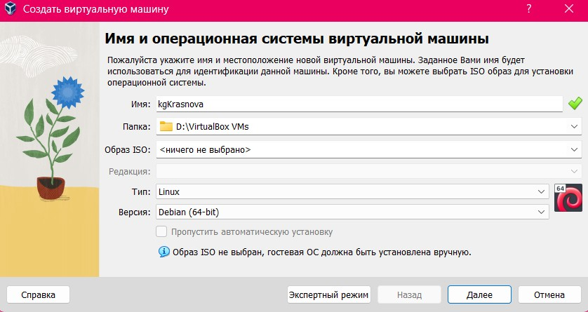
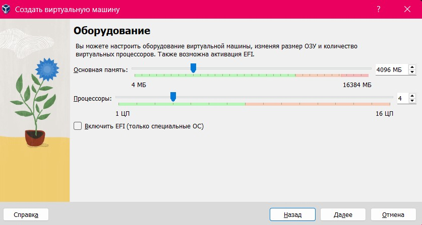
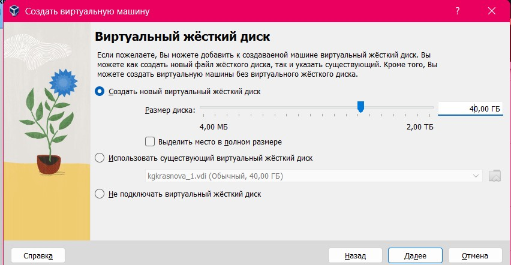
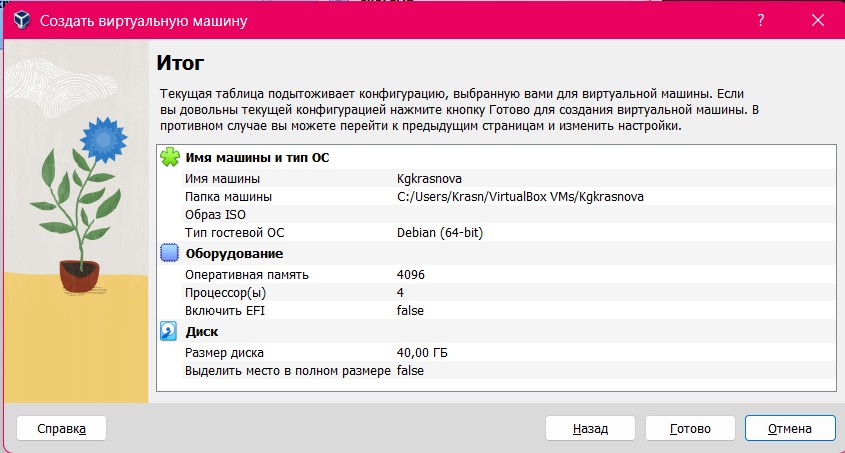
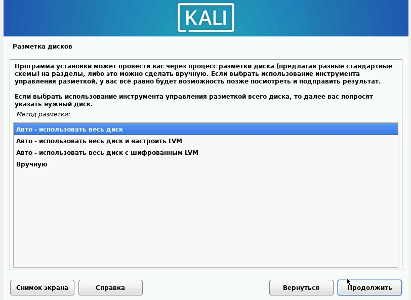
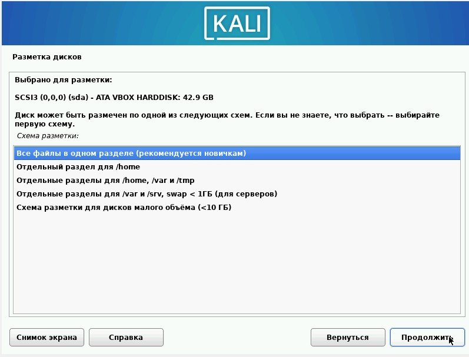
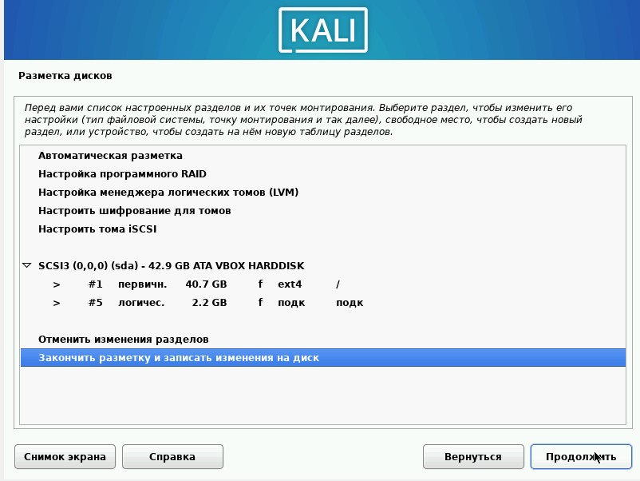
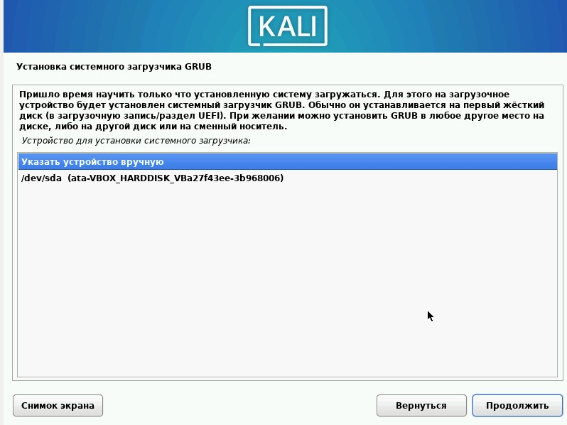
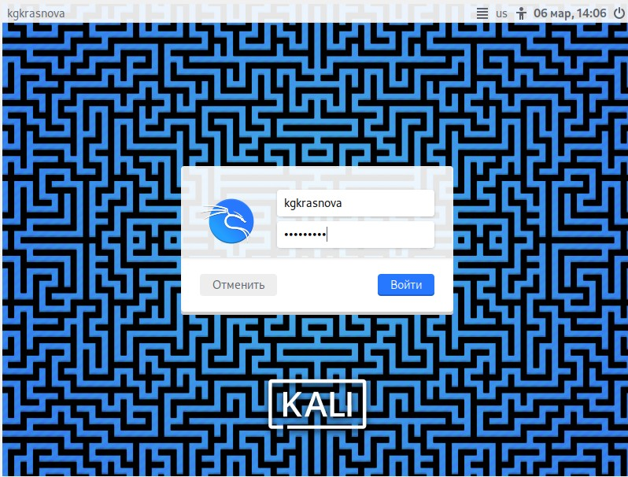

---
## Front matter
lang: ru-RU
title: 1 этап индивидуального проекта
subtitle: Основы информационной безопасности
author:
  - Краснова К. Г., НКАбд-03-24
institute:
  - Российский университет дружбы народов, Москва, Россия
date: 17 февраля 2026

## i18n babel
babel-lang: russian
babel-otherlangs: english

## Formatting pdf
toc: false
toc-title: Содержание
slide_level: 2
aspectratio: 169
section-titles: true
theme: metropolis
header-includes:
 - \metroset{progressbar=frametitle,sectionpage=progressbar,numbering=fraction}
---

## Цель работы

Приобретение практических навыков по установке операционной системы Linux на виртуальную машину.

## Задание

1. Установить дистрибутив Kali Linux на виртуальную машину VirtualBox.

## Теоретическое введение

Kali Linux — это дистрибутив Linux на основе Debian с открытым исходным кодом, предназначенный для расширенного тестирования на проникновение, проверки уязвимостей, аудита безопасности систем и сетей.

**Сферы применения дистрибутива**:

- Тестирование на проникновение. Kali Linux широко используется в области тестирования безопасности, чтобы оценить уязвимости в компьютерных системах, сетях и приложениях. ОС предоставляет множество инструментов для обнаружения уязвимостей.

- Цифровое расследование. Дистрибутив предоставляет инструменты для сбора и анализа цифровых данных, включая восстановление удаленных файлов, извлечение метаданных, анализ системных журналов и т.д.

- Обратная разработка. Kali Linux содержит инструменты, которые помогают разработчикам анализировать готовое программное обеспечение, чтобы понять его работу, выявить уязвимости или разработать альтернативные реализации.

- Безопасность беспроводных сетей. У ОС есть набор инструментов для проверки и обеспечения безопасности беспроводных сетей. Kali Linux поддерживает анализ беспроводных протоколов, перехват и дешифрование сетевого трафика, а также атаки на беспроводные сети.

- Защита информации. Kali Linux также может использоваться для обеспечения безопасности информации, включая мониторинг сетевой активности, обнаружение вторжений, защиту от DDoS-атак и настройку брандмауэров.

## Выполнение лабораторной работы

Открываю VirtualBox, нажимаю `создать`, в появившемся окне выбираю тип операционной системы Linux, версия - Debian, задаю имя машины ([рис. @fig-001]).

{#fig-001 width=70%}

## Выполнение лабораторной работы

Настраиваю основную память и количество выделяемых процессоров, необходимое для работы без помех ([рис. @fig-002]).

{#fig-002 width=70%}

## Выполнение лабораторной работы

Настраиваю размер виртуального жесткого диска, выбираю 40ГБ ([рис. @fig-003]).

{#fig-003 width=70%}

## Выполнение лабораторной работы

Соглашаюсь с получившимися характеристиками, жму `готово` ([рис. @fig-004]).

{#fig-004 width=70%}

## Выполнение лабораторной работы

В окне установки Kali выбираю графическую установку, выбираю язык, на котором будет установка В местоположении выбираю Российскую Федерацию Выбираю раскладку клавиатуры комбинацию горячих клавиш ([рис. @fig-005]).

{#fig-005 width=70%}

## Выполнение лабораторной работы

Ввожу имя компьютера ([рис. @fig-006]).

{#fig-006 width=70%}

## Выполнение лабораторной работы

Ввожу имя домена ([рис. @fig-007]).

{#fig-007 width=70%}

## Выполнение лабораторной работы

Ввожу имя пользователя, у которой будут права суперпользователя ([рис. @fig-008]).

{#fig-008 width=70%}

## Выполнение лабораторной работы

Ввожу пароль для созданного пользователя ([рис. @fig-009]).

{#fig-009 width=70%}

## Выполнение лабораторной работы

Теперь установщик проверяет диски и предлагает различные варианты,
в зависимости от настроек. Созданный виртуальный диск чистый, поэтому
я выбираю «весь диск»  ([рис. @fig-010]).

{#fig-010 width=70%}

## Выполнение лабораторной работы

Далее установщик предлагает выбрать схему разметки, ее я оставляю по
умолчанию «все файлы в одном разделе» После этого этапа надо подтвердить
окончание разметки дисков, чтобы изменения были записаны ([рис. @fig-011]).

{#fig-011 width=70%}

## Выполнение лабораторной работы

Затем установщик дает еще раз просмотреть конфигурацию диска,
прежде чем внести необратимые изменения (рис. 21). После этого этапа
начнется установка. ([рис. @fig-012]).

{#fig-012 width=70%}

Подтверждаю установку системного загрузчика GRUB (Загрузчик
операционной системы от проекта GNU программа для управления
процессом загрузки), также выбираю виртуальный диск, на который
устанавливать GRUB ([рис. @fig-013]).

{#fig-013 width=70%}

## Выполнение лабораторной работы

Завершаю установку ([рис. @fig-014]).

{#fig-014 width=70%}

## Выполнение лабораторной работы

Вхожу в систему от имени своего пользователя ([рис. @fig-015]).

{#fig-015 width=70%}

## Выводы

Приобрела практические навыки по установке операционной системы Linux на виртуальную машину. Установила дистрибутив Kali LInux на VirtualBox.

## Список литературы{.unnumbered}

[1] [Официальная документация по устновке Kali Linux на VirtualBox](https://www.kali.org/docs/virtualization/install-virtualbox-guest-vm/)
